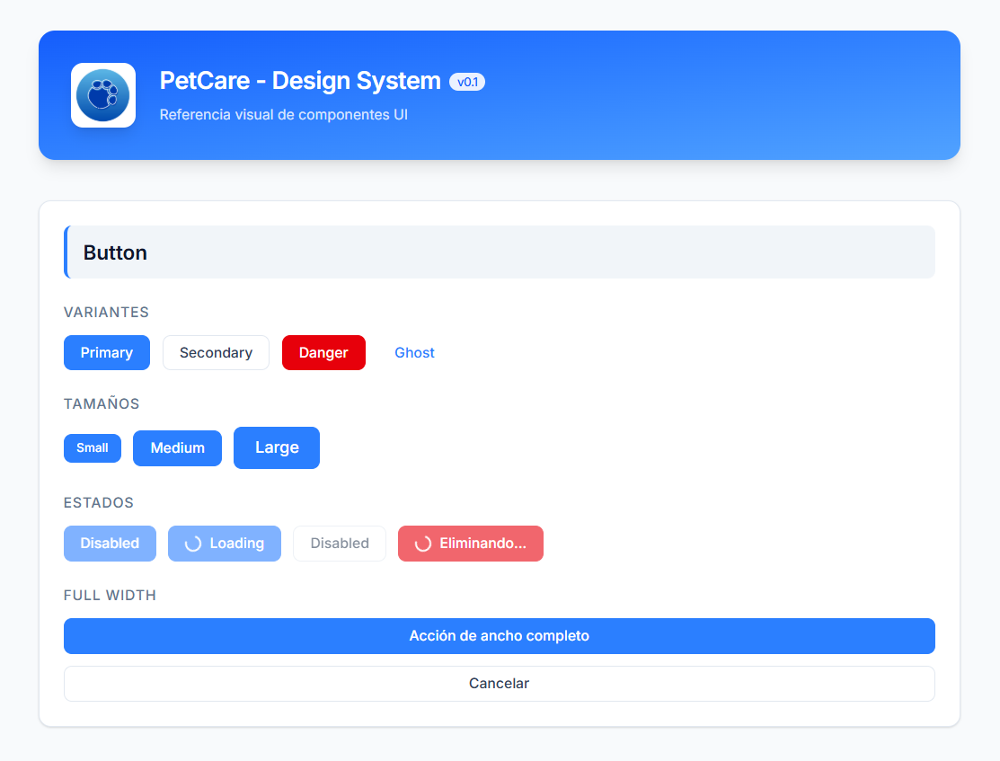

# PetCare Frontend

Aplicación web para la gestión de clínicas veterinarias pequeñas y medianas.

PetCare busca ofrecer una interfaz moderna, clara y escalable para administrar información clínica veterinaria, incluyendo pacientes, citas, historial clínico y componentes reutilizables del sistema de diseño.

## Stack tecnológico

- **Runtime:** Bun
- **Build tool:** Vite
- **Framework:** React 19
- **Lenguaje:** TypeScript (strict mode)
- **Estilos:** Tailwind CSS v4 + Design Tokens
- **Utilidades de clases:** clsx
- **Formato de código:** Prettier

## Inicio rápido

```bash
# Instalar dependencias
bun install

# Iniciar servidor de desarrollo
bun run dev

# Verificar tipos y construir para producción
bun run build

# Formatear código
bun run format

# Verificar formato sin modificar archivos
bun run format:check

# Ejecutar linter
bun run lint
```

## Estructura del proyecto

```txt
src/
├── app/                    # Router y componente raíz
├── components/
│   ├── ui/                 # Primitivos del sistema de diseño
│   ├── layout/             # Sidebar, Header, PageContainer
│   └── shared/             # Showcase y componentes compartidos
├── features/
│   ├── auth/               # Autenticación (components, hooks, context)
│   ├── patients/           # Gestión de pacientes
│   ├── appointments/       # Gestión de citas
│   ├── consultations/      # Consultas clínicas
│   └── dashboard/          # Dashboard operativo
├── hooks/                  # Hooks globales (useDebounce, useOnlineStatus)
├── lib/
│   ├── api/                # Cliente HTTP y endpoints
│   ├── constants/          # Constantes globales del dominio que no son opciones de UI
│   └── db/                 # IndexedDB y sincronización futura
│   └── utils/              # Formatters, validadores, constantes
├── styles/                 # Tokens CSS y variables globales
├── types/                  # Interfaces TypeScript compartidas
└── index.css               # Tailwind, @theme y estilos base globales
```

> Nota: algunas carpetas forman parte de la arquitectura objetivo del proyecto. La aplicación se está construyendo de forma progresiva, priorizando primero el sistema de diseño y los componentes reutilizables.

## Arquitectura feature-based

El proyecto agrupa el código por **dominio de negocio**, no solamente por tipo de archivo. Cada feature puede contener sus propios componentes, hooks, páginas y lógica relacionada.

**Regla de dependencia:** los features pueden importar de `components/`, `hooks/`, `lib/` y `types/`, pero las capas compartidas no deben depender de features específicas.

Ejemplo conceptual:

```txt
features/patients/
├── components/
├── hooks/
├── pages/
└── types.ts
```

Esto permite que módulos como pacientes, citas, consultas o dashboard crezcan sin mezclar responsabilidades.

## Convención de componentes UI

Los componentes primitivos del sistema de diseño siguen una estructura modular. Actualmente, la migración se está orientando a Tailwind CSS con clases organizadas en archivos `.styles.ts`.

```txt
components/ui/Button/
├── Button.tsx              # Componente React
├── Button.types.ts         # Tipos e interface de props
├── Button.styles.ts        # Clases Tailwind organizadas por variante/estado
└── index.ts                # Barrel file
```

### Datos (constantes) reutilizables del dominio

PetCare organiza los datos estáticos reutilizables dentro de `src/lib/`. Las opciones usadas en formularios, filtros o componentes `Select` se guardan en `lib/options/` con el sufijo `.options.ts`; las constantes generales del dominio viven en `lib/constants/`.

```txt
lib/constants/
├── species.options.ts             # Especies de pacientes
├── consultationTypes.options.ts   # Tipos de consulta
├── appointmentStatus.options.ts   # Estados de cita
└── index.ts                       # Barrel file
```
**Convenciones:**
- Nombres en MAYÚSCULAS para identificarlas como constantes inmutables (`SPECIES`, `CONSULTATION_TYPES`)
- Tipadas con `SelectOption[]` cuando son opciones de un Select
- Importadas desde el barrel: `import { SPECIES } from '@/lib/constants'`

### Responsabilidad de cada archivo

- **`Component.tsx`** contiene la estructura JSX y la lógica mínima del componente.
- **`Component.types.ts`** define el contrato de props con TypeScript.
- **`Component.styles.ts`** centraliza clases de Tailwind para base, variantes, tamaños y estados.
- **`index.ts`** permite imports limpios desde otras partes del proyecto.

Ejemplo:

```ts
export const buttonBase =
  'inline-flex items-center justify-center gap-2 rounded-lg border font-medium leading-tight transition-all duration-300 ease-out active:scale-95 disabled:pointer-events-none disabled:cursor-not-allowed disabled:opacity-60';

export const buttonVariants = {
  primary:
    'border-blue-500 bg-blue-500 text-white hover:border-blue-600 hover:bg-[var(--color-primary-600)] active:bg-blue-700',
  secondary: 'border-slate-200 bg-white text-slate-700 hover:bg-slate-100',
  danger:
    'border-red-600 bg-red-600 text-white hover:border-red-700 hover:bg-red-700',
  ghost: 'border-transparent bg-transparent text-blue-500 hover:bg-slate-100',
};
```

## Sistema de diseño

El sistema de diseño de PetCare combina **Tailwind CSS v4** con **Design Tokens** propios.

Los tokens de diseño se mantienen centralizados en `src/styles/tokens.css` y definen valores globales del proyecto:

- **Colores:** paleta de marca, neutrales y semánticos (`success`, `warning`, `danger`).
- **Tipografía:** Inter como fuente base y escala de tamaños en `rem`.
- **Espaciado:** escala consistente basada en múltiplos pequeños.
- **Bordes y sombras:** radios y sombras reutilizables.
- **Transiciones:** duraciones estandarizadas (`fast`, `normal`, `slow`).

Tailwind se utiliza para construir los estilos visuales de los componentes mediante clases utilitarias. Los tokens siguen siendo útiles para valores globales, compatibilidad con partes existentes y valores personalizados mediante `var(...)`.

Ejemplo de uso de tokens dentro de Tailwind:

```tsx
<div className="rounded-[var(--radius-lg)] bg-[var(--color-background)] text-[var(--color-text-primary)]">
  Contenido
</div>
```

## Configuración global de estilos

El archivo `src/index.css` es el punto de entrada global de estilos. Actualmente cumple tres funciones principales:

1. Importar la fuente Inter.
2. Cargar Tailwind CSS.
3. Cargar los tokens globales y definir estilos base.

```css
@import url('https://fonts.googleapis.com/css2?family=Inter:wght@400;500;600;700&display=swap');
@import 'tailwindcss';
@import './styles/tokens.css';

@theme {
  --font-sans: var(--font-family);
}

@layer base {
  *,
  *::before,
  *::after {
    box-sizing: border-box;
  }

  html {
    font-size: 16px;
    font-family: var(--font-family);
    -webkit-font-smoothing: antialiased;
    -moz-osx-font-smoothing: grayscale;
  }

  body {
    min-height: 100vh;
    margin: 0;
    font-family: var(--font-family);
    font-size: var(--font-size-base);
    line-height: var(--line-height-normal);
    color: var(--color-text-primary);
    background-color: var(--color-surface);
  }

  #root {
    min-height: 100vh;
  }

  input,
  button,
  textarea,
  select {
    font: inherit;
  }

  button {
    cursor: pointer;
  }

  :focus-visible {
    outline: 2px solid var(--color-primary-500);
    outline-offset: 2px;
  }
}
```

La regla `@theme` conecta Tailwind con los tokens del proyecto. Por ejemplo, permite que `font-sans` use la fuente principal definida en `--font-family`.

## Migración a Tailwind CSS

El proyecto se está migrando gradualmente desde CSS Modules hacia Tailwind CSS.

La estrategia actual es:

1. Mantener `tokens.css` como fuente de valores globales del diseño.
2. Usar Tailwind para los estilos visuales de los componentes.
3. Organizar clases reutilizables en archivos `.styles.ts`.
4. Usar `clsx` para combinar clases base, variantes, tamaños y estados condicionales.
5. Eliminar CSS Modules conforme cada componente queda migrado y probado.

Ejemplo de composición de clases:

```tsx
import clsx from 'clsx';
import { buttonBase, buttonSizes, buttonVariants } from './Button.styles';

const Button = ({ variant = 'primary', size = 'md', fullWidth = false, className, ...rest }) => {
  return (
    <button
      className={clsx(
        buttonBase,
        buttonVariants[variant],
        buttonSizes[size],
        fullWidth && 'w-full',
        className
      )}
      {...rest}
    />
  );
};
```

Este patrón mantiene los componentes legibles y evita repetir clases largas directamente en cada archivo JSX.

## Componentes UI disponibles

| Componente | Ubicación | Descripción |
|------------|-----------|-------------|
| Button | `components/ui/Button` | Botón con variantes, tamaños, estado loading, disabled y ancho completo |
| Input | `components/ui/Input` | Campo de texto con label, hint, error, disabled, fullWidth e ícono izquierdo |
| Card | `components/ui/Card` | Contenedor visual con variantes `default`, `outline` y `ghost` |
| Badge | `components/ui/Badge` | Etiquetas de estado con variantes semánticas |
| Spinner | `components/ui/Spinner` | Indicador de carga con tamaños y label opcional |
| Modal | `components/ui/Modal` | Ventana modal con portal, overlay, cierre por Escape y bloqueo de scroll |

## Showcase de componentes

La página de referencia visual (`DesignSystemShowcase`) muestra los componentes UI en sus variantes, tamaños y estados.

Su objetivo es servir como una vitrina interna durante el desarrollo para comprobar que los componentes se vean y funcionen de manera consistente.

```txt
components/shared/DesignSystemShowcase/
├── DesignSystemShowcase.tsx          # Página principal del showcase
├── DesignSystemShowcase.styles.ts    # Clases Tailwind del layout del showcase
├── ShowcaseLayout.tsx                # Section y Subsection reutilizables
└── sections/                         # Secciones por componente UI
```



## Convenciones de código

### Commits

Se sigue la convención [Conventional Commits](https://www.conventionalcommits.org/):

```txt
feat     → nueva funcionalidad
fix      → corrección de bug
chore    → tareas de mantenimiento (config, dependencias)
style    → cambios de formato (no lógica)
refactor → reestructurar código sin cambiar funcionalidad
docs     → documentación
```

Ejemplos:

```bash
git commit -m "refactor(button): migrate styles to Tailwind"
git commit -m "docs: update README after Tailwind migration"
```

### TypeScript

- `strict: true` habilitado.
- `verbatimModuleSyntax: true` para separar imports de tipos con `import type`.
- Alias `@/` apunta a `src/` para imports limpios.
- Las props de componentes reutilizables se definen en archivos `.types.ts`.

Ejemplo:

```ts
import type { ButtonHTMLAttributes, ReactNode } from 'react';

export interface ButtonProps extends ButtonHTMLAttributes<HTMLButtonElement> {
  children: ReactNode;
  variant?: 'primary' | 'secondary' | 'danger' | 'ghost';
  size?: 'sm' | 'md' | 'lg';
  isLoading?: boolean;
  fullWidth?: boolean;
}
```

### Estilos

- Usar Tailwind CSS para estilos visuales nuevos o migrados.
- Usar archivos `.styles.ts` para componentes con variantes o estados.
- Usar `clsx` para clases condicionales.
- Mantener `tokens.css` para variables globales del sistema de diseño.
- Evitar agregar estilos específicos de componentes en `index.css`.

### Accesibilidad

Los componentes deben considerar atributos accesibles cuando aplique:

- `aria-invalid` en campos con error.
- `aria-describedby` para conectar hints o mensajes de error.
- `role="status"` en indicadores de carga.
- `role="dialog"` y `aria-modal="true"` en modales.
- `aria-label` en botones de ícono o acciones sin texto visible.

## Roadmap general

- Consolidar el sistema de diseño con Tailwind CSS.
- Integrar React Router v7 para rutas principales.
- Crear vistas para dashboard, pacientes, citas y consultas.
- Preparar almacenamiento local con enfoque offline-first.
- Evaluar IndexedDB para persistencia local.
- Preparar la base para integración futura con backend.
- Documentar decisiones técnicas conforme avance el proyecto.

## Notas de mantenimiento

- Antes de borrar un archivo CSS antiguo, confirmar que ningún componente lo importa.
- Ejecutar `bun run build` después de migraciones importantes.
- Mantener commits pequeños cuando se migren componentes individuales.
- Actualiz